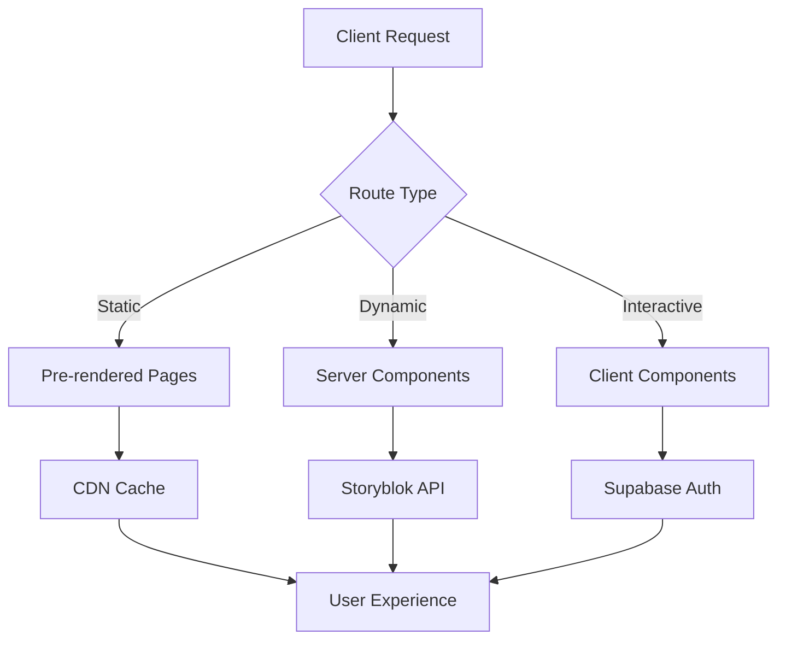

# 🏥 Wellvitas Wellness Centre

[](https://nextjs.org/)
[](https://reactjs.org/)
[](https://www.storyblok.com/)
[](https://supabase.com/)
[](https://tailwindcss.com/)
[](https://github.com/YOUR_GITHUB_USERNAME/wellvitas-web)

> **Enterprise-grade wellness centre website built with modern React Server Components architecture, headless CMS content management, and integrated booking system.**

---

## 🏗️ System Architecture

### **Hybrid Rendering Strategy**


- **Static Site Generation (SSG)** - Pre-rendered pages for optimal performance
- **React Server Components (RSC)** - Server-side rendering for dynamic content
- **Client Components** - Interactive features with minimal JavaScript
- **Edge Runtime** - Authentication and API middleware

### **Microservices Integration**
```
┌─────────────────┐    ┌─────────────────┐    ┌─────────────────┐
│   Storyblok     │    │    Supabase     │    │   SuperSaaS     │
│  Headless CMS   │◄──►│  Authentication │◄──►│    Booking      │
│                 │    │   & Database    │    │    System       │
└─────────────────┘    └─────────────────┘    └─────────────────┘
         ▲                       ▲                       ▲
         │                       │                       │
         ▼                       ▼                       ▼
┌─────────────────────────────────────────────────────────────────┐
│                    Next.js Application                         │
│  RSC + Client Components + API Routes + Middleware             │
└─────────────────────────────────────────────────────────────────┘
```

---

## 🚀 Technology Stack

### **Core Framework**
- **[Next.js 15.5.6](https://nextjs.org/)** - App Router with React Server Components
- **[React 19.1.0](https://reactjs.org/)** - Latest with concurrent features
- **[Tailwind CSS 4.1.16](https://tailwindcss.com/)** - Utility-first styling with custom design system

### **Content Management**
- **[Storyblok](https://www.storyblok.com/)** - Headless CMS with Visual Editor
- **Custom Component Library** - 25 purpose-built Storyblok blocks
- **Real-time Preview** - Live editing in Storyblok Visual Editor

### **Authentication & Database**
- **[Supabase](https://supabase.com/)** - PostgreSQL database with Row Level Security
- **Auth System** - Email/password with verification, password reset, profile management
- **Security** - Rate limiting, CSRF protection, secure session handling

### **Booking Integration**
- **[SuperSaaS](https://www.supersaas.com/)** - Professional appointment scheduling
- **Embedded Widget** - Seamless booking experience
- **Account Integration** - Direct integration with Wellvitas SuperSaaS account

### **Deployment & DevOps**
- **GitHub Actions** - Automated CI/CD pipeline
- **Fasthosts Hosting** - Static site deployment via FTP
- **Custom Image Optimization** - Storyblok CDN integration

---

## 📁 Project Structure

```
wellvitas-web/
├── 📁 .github/workflows/       # CI/CD automation
│   ├── deploy-fasthosts.yml    # Production deployment pipeline
│   └── README.md               # Workflow documentation
├── 📁 src/
│   ├── 📁 app/                 # Next.js App Router
│   │   ├── layout.js           # Root layout with providers
│   │   ├── page.js             # Homepage (Server Component)
│   │   ├── 📁 [...slug]/       # Dynamic Storyblok routes
│   │   ├── 📁 (public)/        # Public route group
│   │   │   ├── 📁 about/       # About section pages
│   │   │   ├── 📁 api/         # API endpoints
│   │   │   ├── booking/        # Booking page
│   │   │   ├── therapies/      # Therapies showcase
│   │   │   └── visit-us/       # Location information
│   │   └── 📁 auth/            # Authentication system
│   │       ├── callback/       # OAuth callback handler
│   │       ├── login/          # Sign in page
│   │       ├── signup/         # User registration
│   │       ├── dashboard/      # User dashboard
│   │       ├── profile/        # Profile management
│   │       ├── reset-password/ # Password reset flow
│   │       └── verify-email/   # Email verification
│   ├── 📁 components/          # React component library
│   │   ├── 📁 auth/           # Authentication components
│   │   │   ├── FormComponents.jsx    # Reusable form elements
│   │   │   └── ProtectedRoute.jsx    # Route protection wrapper
│   │   ├── 📁 storyblock/     # Storyblok component blocks (25 components)
│   │   │   ├── PageBlok.jsx           # Page wrapper component
│   │   │   ├── NavigationBlok.jsx     # Site navigation
│   │   │   ├── HeroCarouselBlok.jsx   # Homepage carousel
│   │   │   ├── HomeTherapiesBlok.jsx  # Therapy showcase
│   │   │   ├── TestimonialsBlok.jsx   # Customer testimonials
│   │   │   ├── SuperSaaSBookingBlok.jsx # Booking integration
│   │   │   ├── FooterBlok.jsx         # Site footer
│   │   │   └── ... (18 more blocks)   # Content & layout blocks
│   │   ├── Header.js          # Site header component
│   │   ├── Footer.js          # Site footer component
│   │   ├── HeroCarousel.js    # Homepage hero carousel
│   │   ├── BookingWidget.js   # SuperSaaS booking widget
│   │   └── ... (12 more)      # UI & feature components
│   ├── 📁 lib/                # Utility libraries
│   │   ├── storyblok.js       # Storyblok configuration & client
│   │   ├── imageLoader.js     # Custom image optimization
│   │   ├── 📁 auth/           # Authentication utilities
│   │   │   ├── authService.js      # Auth business logic
│   │   │   ├── validation.js       # Input validation rules
│   │   │   ├── rateLimit.js        # Rate limiting implementation
│   │   │   └── constants.js        # Auth constants
│   │   └── 📁 supabase/       # Supabase integration
│   │       ├── client.js           # Client-side Supabase
│   │       └── server.js           # Server-side Supabase
│   ├── 📁 providers/          # React context providers
│   │   └── AuthProvider.jsx   # Global authentication state
│   ├── 📁 styles/             # Styling system
│   │   └── globals.css        # Global styles + Tailwind
│   └── middleware.js          # Next.js middleware for auth
├── 📁 scripts/                # Utility scripts
│   └── test-storyblok.js      # Storyblok connection tester
├── next.config.mjs            # Next.js configuration
├── tailwind.config.js         # Tailwind CSS configuration
├── package.json               # Dependencies & scripts
└── .env                       # Environment variables
```

---

## 🎯 Key Features

### **🎨 Content Management System**
- **Visual Editor** - Real-time content editing in Storyblok
- **25 Custom Blocks** - Purpose-built components for wellness industry
- **Multi-language Ready** - Storyblok's internationalization support
- **SEO Optimized** - Dedicated SEO block with meta management

### **🔐 Authentication System**
- **Complete User Flow** - Registration, login, profile, password reset
- **Security Features** - Rate limiting (5 attempts/15min), CSRF protection
- **Email Verification** - Required for account activation
- **Protected Routes** - Dashboard and profile pages require authentication

### **📅 Booking Integration**
- **SuperSaaS Widget** - Professional appointment scheduling
- **Embedded Experience** - Seamless booking without external redirects
- **Account Management** - Direct integration with Wellvitas booking system

### **📱 Responsive Design**
- **Mobile-First** - Optimized for all device sizes
- **Modern UI/UX** - Clean, professional wellness industry design
- **Performance Optimized** - 90+ Lighthouse score target

### **🚀 Deployment Pipeline**
- **One-Click Deployment** - Push to main branch triggers auto-deploy
- **Static Export** - Optimized for Fasthosts shared hosting
- **Environment Management** - Secure handling of API keys and secrets

---

## 🛠️ Development Setup

### **Prerequisites**
```bash
Node.js >= 18.0.0
npm >= 9.0.0
Git >= 2.30.0
```

### **Quick Start**
```bash
# 1. Clone repository
git clone https://github.com/YOUR_GITHUB_USERNAME/wellvitas-web.git
cd wellvitas-web

# 2. Install dependencies
npm install

# 3. Set up environment variables
cp .env.example .env
# Edit .env with your API keys (see Environment Setup below)

# 4. Test Storyblok connection
node scripts/test-storyblok.js

# 5. Start development server
npm run dev
```

### **Environment Setup**
```env
# Storyblok CMS Configuration
NEXT_PUBLIC_STORYBLOK_ACCESS_TOKEN=your_storyblok_token
NEXT_PUBLIC_STORYBLOK_BRAND_SPACE_ID=your_space_id
NEXT_PUBLIC_STORYBLOK_DEFAULT_SPACE_ID=your_space_id
NEXT_PUBLIC_STORYBLOK_REGION=eu
STORYBLOK_PREVIEW_SECRET=your_preview_secret

# Supabase Authentication
NEXT_PUBLIC_SUPABASE_URL=https://your-project.supabase.co
NEXT_PUBLIC_SUPABASE_ANON_KEY=your_supabase_anon_key

# SuperSaaS Booking Integration
SUPERSAAS_ACCOUNT_NAME=wellvitas
```

### **Available Scripts**
```bash
npm run dev          # Start development server (localhost:3000)
npm run build        # Build for production
npm run start        # Start production server
npm run lint         # Run ESLint
npm run export       # Build and export static site
```

---

## 🏗️ Architecture Patterns

### **React Server Components (RSC)**
```jsx
// Server Component (default) - runs on server
export default async function HomePage() {
  // Direct data fetching on server
  const story = await getStoryblokStory('home');
  
  return (
    <div>
      <ServerComponent data={story} />
      <ClientComponent />  {/* Interactive component */}
    </div>
  );
}

// Client Component - runs in browser
'use client';
export default function InteractiveWidget() {
  const [state, setState] = useState();
  // Client-side interactivity
}
```

### **Component Composition Pattern**
```jsx
// Storyblok Block Architecture
export default function PageBlok({ blok }) {
  return (
    <div className="page-container">
      {blok.body?.map((block) => (
        <StoryblokComponent blok={block} key={block._uid} />
      ))}
    </div>
  );
}
```

### **Authentication Flow**
```jsx
// Protected Route Pattern
export default function ProtectedPage() {
  return (
    <ProtectedRoute>
      <UserDashboard />
    </ProtectedRoute>
  );
}

// Auth Provider Pattern
export function AuthProvider({ children }) {
  const [user, setUser] = useState(null);
  // Global auth state management
  return (
    <AuthContext.Provider value={{ user, setUser }}>
      {children}
    </AuthContext.Provider>
  );
}
```

---

## 🔧 API Integration

### **Storyblok CMS API**
```javascript
// lib/storyblok.js
export const getStoryblokApi = () => {
  return new StoryblokApi({
    accessToken: process.env.NEXT_PUBLIC_STORYBLOK_ACCESS_TOKEN,
    region: process.env.NEXT_PUBLIC_STORYBLOK_REGION,
    use: [apiPlugin]
  });
};

// Component registration for Visual Editor
storyblokInit({
  components: {
    page: PageBlok,
    navigation: NavigationBlok,
    hero_carousel: HeroCarouselBlok,
    // ... 22 more components
  }
});
```

### **Supabase Authentication**
```javascript
// lib/supabase/client.js
import { createBrowserClient } from '@supabase/ssr';

export const createClient = () => {
  return createBrowserClient(
    process.env.NEXT_PUBLIC_SUPABASE_URL,
    process.env.NEXT_PUBLIC_SUPABASE_ANON_KEY
  );
};
```

### **SuperSaaS Booking**
```jsx
// components/storyblock/SuperSaaSBookingBlok.jsx
export default function SuperSaaSBookingBlok({ blok }) {
  return (
    <div className="booking-container">
      <script 
        src={`https://supersaas.com/api/js/${blok.account_name}.js`}
        async
      />
      <div id="ssas-widget" />
    </div>
  );
}
```

---

## 🚀 Deployment

### **Production Deployment (Recommended)**
**Automatic deployment via GitHub Actions:**

1. **Push to main branch**
   ```bash
   git push origin main
   ```

2. **GitHub Actions automatically:**
   - Installs dependencies
   - Runs build with static export
   - Deploys to Fasthosts via FTP
   - Updates live site in ~2-3 minutes

### **Manual Deployment**
```bash
# 1. Enable static export
# Uncomment 'output: export' in next.config.mjs

# 2. Build static site
npm run build

# 3. Upload 'out' folder contents to hosting
# Upload ./out/* to /public_html/ via FTP
```

### **GitHub Secrets Configuration**
Required secrets in repository settings:
```
STORYBLOK_ACCESS_TOKEN    # Storyblok API token
STORYBLOK_SPACE_ID        # Space ID for webhook
FTP_SERVER               # Fasthosts FTP server
FTP_USERNAME             # FTP username
FTP_PASSWORD             # FTP password
```

---

## 📊 Performance Optimization

### **Build Optimization**
- **Static Export** - Pre-rendered HTML for optimal performance
- **Image Optimization** - Custom Storyblok CDN integration
- **Code Splitting** - Automatic route-based splitting
- **Tree Shaking** - Unused code elimination

### **Expected Metrics**
```
Bundle Size:     102 kB (shared)
Build Time:      ~4 seconds  
Pages Generated: 24 static pages
Lighthouse:      90+ performance score
```

### **Loading Strategy**
```javascript
// Custom image loader for Storyblok CDN
export default function storyblokLoader({ src, width, quality }) {
  return `https://a.storyblok.com${src}/m/${width}x0/filters:quality(${quality || 75})`;
}
```

---

## 🔒 Security Implementation

### **Authentication Security**
- **Rate Limiting** - 5 login attempts per 15 minutes
- **Password Validation** - Minimum 8 characters, complexity requirements
- **CSRF Protection** - Supabase built-in CSRF handling
- **Secure Sessions** - HTTP-only cookies, secure flags

### **Environment Security**
```javascript
// Environment variable validation
if (!process.env.NEXT_PUBLIC_STORYBLOK_ACCESS_TOKEN) {
  throw new Error('Missing required Storyblok access token');
}

// API key protection
const isProduction = process.env.NODE_ENV === 'production';
const apiKey = isProduction ? process.env.PROD_API_KEY : process.env.DEV_API_KEY;
```

### **Content Security**
- **Input Sanitization** - All user inputs validated and sanitized
- **XSS Prevention** - React's built-in XSS protection
- **Content Validation** - Storyblok schema validation

---

## 📚 Component Library

### **Core Storyblok Blocks**
| Component | Purpose | Features |
|-----------|---------|----------|
| `PageBlok` | Page wrapper | SEO, layout structure |
| `NavigationBlok` | Site navigation | Multi-level menu, mobile responsive |
| `HeroCarouselBlok` | Homepage hero | Auto-playing carousel, call-to-actions |
| `HomeTherapiesBlok` | Therapy showcase | Service highlighting, links to booking |
| `TestimonialsBlok` | Customer reviews | Carousel, star ratings, social proof |
| `SuperSaaSBookingBlok` | Booking widget | Embedded appointment scheduling |
| `FooterBlok` | Site footer | Contact info, social links, hours |

### **Content Blocks**
| Component | Purpose | Use Cases |
|-----------|---------|-----------|
| `RichTextBlok` | Formatted content | Articles, descriptions, body text |
| `ImageBlok` | Media display | Hero images, galleries, illustrations |
| `ButtonBlok` | Call-to-actions | Links, bookings, contact prompts |
| `IntroBandBlok` | Page headers | Section introductions, page titles |
| `QuoteBlok` | Highlighted text | Customer quotes, key messages |
| `VideoBlok` | Video content | Therapy demonstrations, testimonials |

### **Layout Blocks**
| Component | Purpose | Features |
|-----------|---------|----------|
| `InfoGridBlok` | Information display | Service grids, feature lists |
| `FaqGridBlok` | FAQ sections | Expandable Q&A, categories |
| `PackagesSectionBlok` | Service packages | Pricing, features, comparisons |
| `TherapySectionBlok` | Therapy details | Descriptions, benefits, booking |

---

## 🧪 Testing & Quality

### **Connection Testing**
```bash
# Test Storyblok API connection
node scripts/test-storyblok.js

# Expected output:
# ✅ Connected to: Wellvitas
# ✅ Found X stories
# ✅ Home page exists
# 🎉 All tests passed!
```

### **Build Validation**
```bash
# Production build test
npm run build

# Expected output:
# ✓ Compiled successfully
# ✓ Linting and checking validity of types
# ✓ Generating static pages (24/24)
```

### **Code Quality**
- **ESLint** - Code style and error detection
- **Prettier** - Consistent code formatting
- **Type Safety** - PropTypes validation for components

---

## 📖 Documentation

### **Technical Documentation**
- **[Server-Side Architecture](docs/SERVER_SIDE.md)** - RSC patterns and data fetching
- **[Component Reference](docs/COMPONENTS_REFERENCE.md)** - Complete API documentation
- **[Authentication System](AUTH_SYSTEM_DOCUMENTATION.md)** - Security implementation
- **[Storyblok Schema](STORYBLOK_SCHEMA_REFERENCE.md)** - CMS content structure

### **User Guides**
- **[CMS Admin Guide](CMS_ADMIN_GUIDE.md)** - Content management workflows
- **[Quick Reference](QUICK_REFERENCE.md)** - 5-minute setup guide
- **[Deployment Ready](DEPLOYMENT_READY.md)** - Production checklist

### **Business Documentation**
- **[Boss Quick Start](BOSS_QUICK_START.md)** - Non-technical overview
- **[Production Summary](PRODUCTION_READY_SUMMARY.md)** - Executive summary

---

## 🤝 Contributing

### **Development Workflow**
1. **Create feature branch** from `main`
2. **Implement changes** following established patterns
3. **Test thoroughly** - build, functionality, responsiveness
4. **Create pull request** with detailed description
5. **Code review** and approval required
6. **Merge to main** triggers automatic deployment

### **Code Standards**
```javascript
// Component naming: PascalCase with descriptive names
export default function HeroCarouselBlok({ blok }) {
  // Props destructuring preferred
  const { slides, autoplay = true } = blok;
  
  // Early returns for better readability
  if (!slides?.length) return null;
  
  // Consistent JSX formatting
  return (
    <section className="hero-carousel">
      {slides.map((slide) => (
        <div key={slide._uid} className="slide">
          {slide.content}
        </div>
      ))}
    </section>
  );
}
```

### **Git Conventions**
```bash
# Commit message format
feat: add booking confirmation email
fix: resolve mobile navigation issue
docs: update API documentation
style: improve button hover states
refactor: optimize image loading logic
```

---

## 📞 Support & Maintenance

### **Technical Support**
- **Developer**: Primary maintainer contact
- **Storyblok**: CMS platform support
- **Supabase**: Authentication service support
- **Fasthosts**: Hosting platform support

### **Monitoring & Health Checks**
- **Uptime Monitoring** - Automated availability tracking
- **Performance Monitoring** - Lighthouse CI integration
- **Error Tracking** - Production error logging
- **SSL Certificate** - Automatic renewal monitoring

### **Update Procedures**
```bash
# Dependencies update
npm update

# Security patches
npm audit fix

# Major version upgrades
# Review breaking changes, test thoroughly
```

---

## 🏆 Production Status

### ✅ **Deployment Ready**
- **Build Status**: SUCCESS (24 pages generated)
- **Component Library**: 25 blocks fully registered
- **Authentication**: Complete Supabase integration
- **CMS**: Storyblok Visual Editor configured
- **Booking**: SuperSaaS widget integration
- **CI/CD**: GitHub Actions pipeline active

### 🎯 **Performance Targets**
- **Lighthouse Performance**: 90+
- **First Contentful Paint**: <1.5s
- **Time to Interactive**: <3s
- **Bundle Size**: <150kB (currently 102kB)

### 🚀 **Ready for Launch**
The application is **production-ready** and can be deployed immediately by pushing to the `main` branch.

---

**Built with ❤️ for Wellvitas Wellness Centre**

*Last Updated: January 2026 | Next.js 15.5.6 | React 19.1.0*