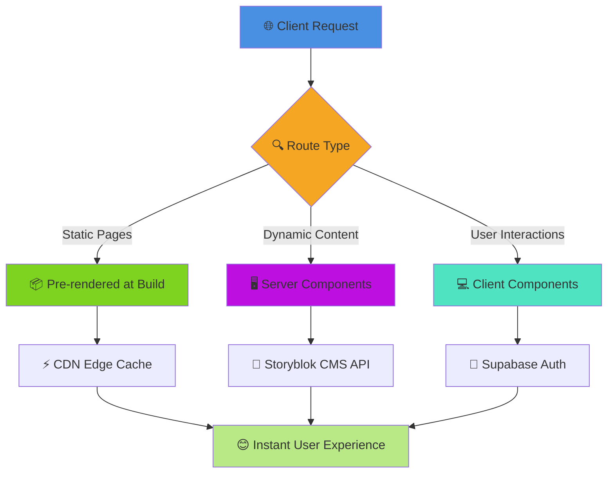

<div align="center">

# 🏥 Wellvitas Wellness Centre

### *Where Technology Meets Wellness*


[](https://nextjs.org/)
[](https://reactjs.org/)
[](https://www.storyblok.com/)
[](https://supabase.com/)
[](https://tailwindcss.com/)
[](https://www.typescriptlang.org/)
[](LICENSE)
[](CONTRIBUTING.md)
[](https://github.com/YOUR_ACTUAL_USERNAME/wellvitas-web)

**Enterprise-grade wellness centre platform powered by cutting-edge React Server Components, headless CMS architecture, and seamless booking integration.**

[🚀 Live Demo](https://wellvitas.com) • [📖 Documentation](https://github.com/YOUR_ACTUAL_USERNAME/wellvitas-web/tree/main/docs) • [🐛 Report Bug](https://github.com/YOUR_ACTUAL_USERNAME/wellvitas-web/issues) • [✨ Request Feature](https://github.com/YOUR_ACTUAL_USERNAME/wellvitas-web/issues)

---

</div>

## 📑 Table of Contents

<details>
<summary><b>Click to expand full navigation</b></summary>

- [🏥 Wellvitas Wellness Centre](#-wellvitas-wellness-centre)
    - [*Where Technology Meets Wellness*](#where-technology-meets-wellness)
  - [📑 Table of Contents](#-table-of-contents)
  - [✨ Highlights](#-highlights)
  - [🎯 What Makes This Special](#-what-makes-this-special)
    - [🌟 **Why Choose This Architecture?**](#-why-choose-this-architecture)
      - [**For Business Owners** 👔](#for-business-owners-)
      - [**For Developers** 👨‍💻](#for-developers-)
  - [🏗️ System Architecture](#️-system-architecture)
    - [**🔄 Hybrid Rendering Strategy**](#-hybrid-rendering-strategy)
      - [**1️⃣ Static Site Generation (SSG)**](#1️⃣-static-site-generation-ssg)
      - [**2️⃣ React Server Components (RSC)**](#2️⃣-react-server-components-rsc)
      - [**3️⃣ Client Components**](#3️⃣-client-components)
    - [**🔌 Microservices Integration Architecture**](#-microservices-integration-architecture)
      - [**Data Flow Examples**](#data-flow-examples)
  - [🚀 Technology Stack](#-technology-stack)
    - [**🎯 Carefully Selected, Battle-Tested Technologies**](#-carefully-selected-battle-tested-technologies)
    - [🎨 **Frontend Layer**](#-frontend-layer)
    - [🔧 **Backend Layer**](#-backend-layer)
    - [🚀 **DevOps Layer**](#-devops-layer)

</details>

---

## ✨ Highlights

<div align="center">

| 🎨 **Visual Editor** | 🔐 **Secure Auth** | 📅 **Smart Booking** | ⚡ **Blazing Fast** |
|:---:|:---:|:---:|:---:|
| Real-time content editing with Storyblok | Enterprise-grade authentication | Integrated SuperSaaS scheduling | 90+ Lighthouse score |
| **25+ Components** | **Rate Limited** | **Embedded Widget** | **< 150KB Bundle** |

</div>

---

## 🎯 What Makes This Special

```ascii
┌─────────────────────────────────────────────────────────────────┐
│  🎯 Built for Wellness Professionals, Loved by Developers       │
└─────────────────────────────────────────────────────────────────┘

✅ No Page Reloads         → React Server Components (RSC)
✅ No Content Bottlenecks  → Headless CMS with Visual Editor  
✅ No Security Concerns    → Row-Level Security + Rate Limiting
✅ No Manual Deployments   → GitHub Actions CI/CD Pipeline
✅ No Performance Issues   → Static Site Generation (SSG)
✅ No Booking Hassles      → Embedded SuperSaaS Integration
```

### 🌟 **Why Choose This Architecture?**

<table>
<tr>
<td width="50%">

#### **For Business Owners** 👔
- ✅ Update content without developer help
- ✅ Schedule appointments seamlessly
- ✅ Know your customer data is secure
- ✅ Get faster page loads = more bookings
- ✅ Pay less for hosting (static files)

</td>
<td width="50%">

#### **For Developers** 👨‍💻
- ✅ Modern React 19 + Next.js 15
- ✅ Type-safe development experience
- ✅ Component-driven architecture
- ✅ Zero backend maintenance
- ✅ Automated CI/CD pipeline

</td>
</tr>
</table>

---

## 🏗️ System Architecture

### **🔄 Hybrid Rendering Strategy**

Our application uses a sophisticated three-tier rendering approach for optimal performance:



<details>
<summary><b>🎓 Click to learn about each rendering strategy</b></summary>

#### **1️⃣ Static Site Generation (SSG)**
- **When**: Build time (once)
- **Best for**: Marketing pages, therapy info, about pages
- **Speed**: ⚡ Instant (served from CDN)
- **Example**: Homepage, About Us, Therapy pages

```javascript
// Automatically generates static HTML at build time
export default async function TherapiesPage() {
  const therapies = await getStaticTherapies();
  return <TherapyList therapies={therapies} />;
}
```

#### **2️⃣ React Server Components (RSC)**
- **When**: On each request (server-side)
- **Best for**: Dynamic content that changes frequently
- **Speed**: 🚀 Fast (no client JS overhead)
- **Example**: User dashboards, personalized content

```javascript
// Runs on server, fetches fresh data each time
export default async function DashboardPage() {
  const userData = await getCurrentUser();
  return <Dashboard user={userData} />;
}
```

#### **3️⃣ Client Components**
- **When**: In the browser (interactive)
- **Best for**: Forms, animations, real-time updates
- **Speed**: 💫 Interactive (runs after hydration)
- **Example**: Booking forms, navigation menus

```javascript
'use client';
// Runs in browser, enables interactivity
export default function BookingForm() {
  const [date, setDate] = useState(null);
  return <DatePicker value={date} onChange={setDate} />;
}
```

</details>

---

### **🔌 Microservices Integration Architecture**

```ascii
┌───────────────────────────────────────────────────────────────────┐
│                    🌐 Next.js Application                        │
│  ┌────────────┐  ┌────────────┐  ┌────────────┐  ┌───────────┐ │
│  │   Pages    │  │    API     │  │ Middleware │  │   Auth    │ │
│  │    RSC     │  │   Routes   │  │  Edge Fn   │  │  Context  │ │
│  └────────────┘  └────────────┘  └────────────┘  └───────────┘ │
└───────┬───────────────┬───────────────┬───────────────┬──────────┘
        │               │               │               │
        ▼               ▼               ▼               ▼
┌──────────────┐ ┌──────────────┐ ┌──────────────┐ ┌──────────────┐
│  📝 Storyblok │ │ 🔐 Supabase  │ │ 📅 SuperSaaS │ │ 📊 Analytics │
│  Headless CMS │ │ Auth + DB    │ │   Booking    │ │   Tracking   │
├──────────────┤ ├──────────────┤ ├──────────────┤ ├──────────────┤
│ • Content    │ │ • Users      │ │ • Schedules  │ │ • Page Views │
│ • Assets     │ │ • Sessions   │ │ • Calendars  │ │ • Events     │
│ • Preview    │ │ • Profiles   │ │ • Bookings   │ │ • Metrics    │
│ • Webhooks   │ │ • RLS        │ │ • Payments   │ │ • Insights   │
└──────────────┘ └──────────────┘ └──────────────┘ └──────────────┘
```

<details>
<summary><b>🔍 Deep Dive: How Services Communicate</b></summary>

#### **Data Flow Examples**

1. **Content Updates (Storyblok → Next.js)**
   ```
   Editor saves in Storyblok → Webhook triggers → Next.js rebuilds → CDN updated
   ```

2. **User Authentication (Supabase → Next.js)**
   ```
   User logs in → Supabase verifies → JWT token → Next.js middleware → Protected route
   ```

3. **Booking Flow (User → SuperSaaS)**
   ```
   User selects time → SuperSaaS widget → Booking confirmed → Email sent
   ```

</details>

---

## 🚀 Technology Stack

<div align="center">

### **🎯 Carefully Selected, Battle-Tested Technologies**

</div>

<table>
<tr>
<td width="33%" valign="top">

### 🎨 **Frontend Layer**

```yaml
Framework:
  Next.js: 15.5.6 (App Router)
  React: 19.1.0 (+ Concurrent)
  
Styling:
  Tailwind CSS: 4.1.16
  CSS Variables: Custom Theme
  Responsive: Mobile-First
  
State Management:
  React Context: Global Auth
  Server State: RSC Native
  Client State: useState/useReducer
```

**Why These?**
- ✅ Next.js 15 = Turbopack build speed
- ✅ React 19 = Better performance
- ✅ Tailwind 4 = Oxide engine speed

</td>
<td width="33%" valign="top">

### 🔧 **Backend Layer**

```yaml
CMS:
  Storyblok: Headless CMS
  Visual Editor: Real-time preview
  Components: 25 custom blocks
  
Authentication:
  Supabase: PostgreSQL + Auth
  Security: Row Level Security
  Sessions: JWT tokens
  
Booking:
  SuperSaaS: Appointment system
  Integration: Embedded widget
  Account: wellvitas
```

**Why These?**
- ✅ Storyblok = Non-dev content editing
- ✅ Supabase = Zero backend code
- ✅ SuperSaaS = Proven booking system

</td>
<td width="33%" valign="top">

### 🚀 **DevOps Layer**

```yaml
Version Control:
  GitHub: Source control
  Actions: CI/CD pipeline
  Secrets: Secure env vars
  
Hosting:
  Fasthosts: Shared hosting
  FTP: Automated deployment
  CDN: Static file serving
  
Monitoring:
  Uptime: Status checks
  Performance: Lighthouse CI
  Errors: Console logging
```