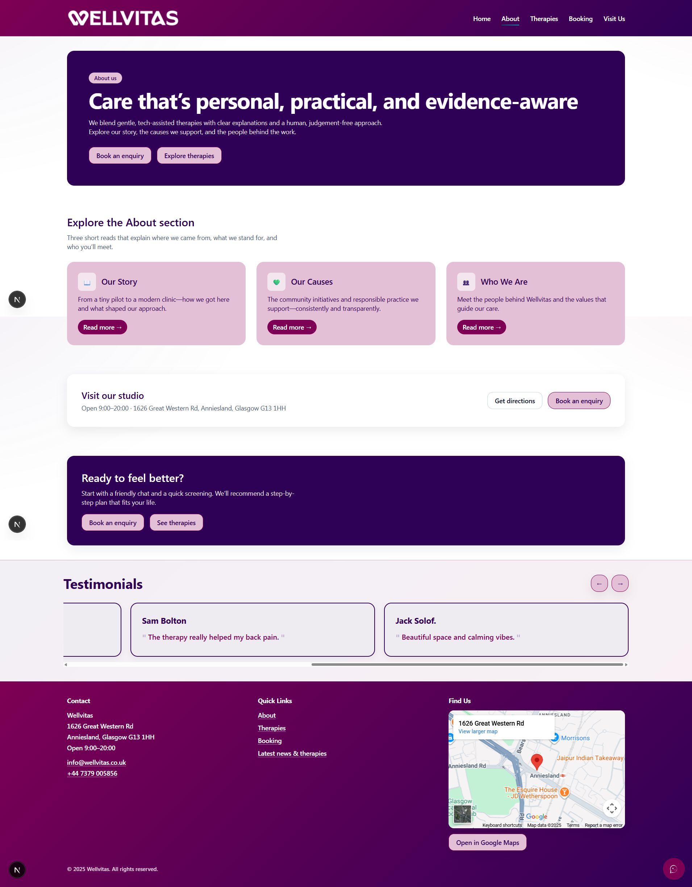
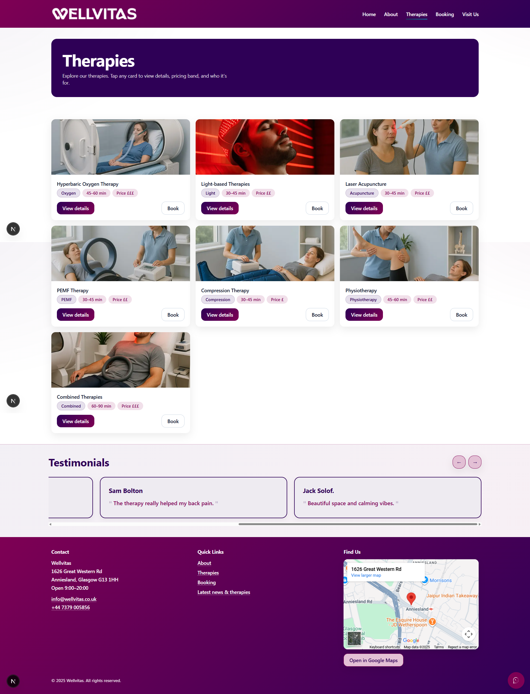
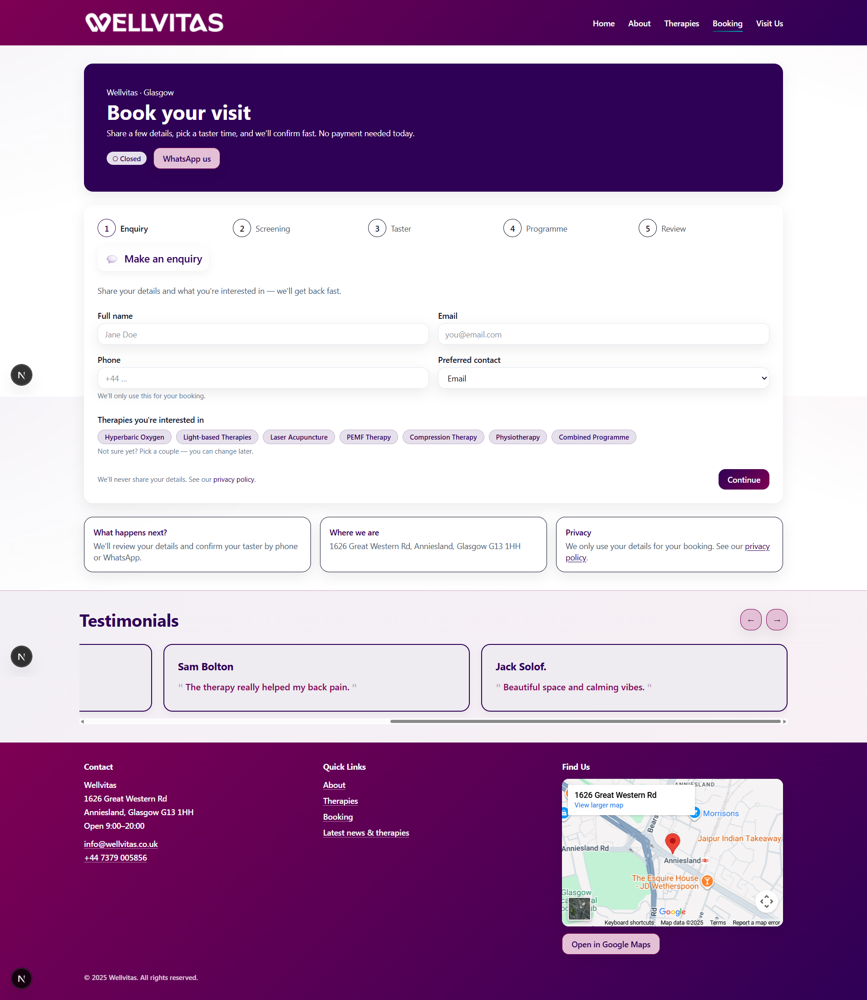
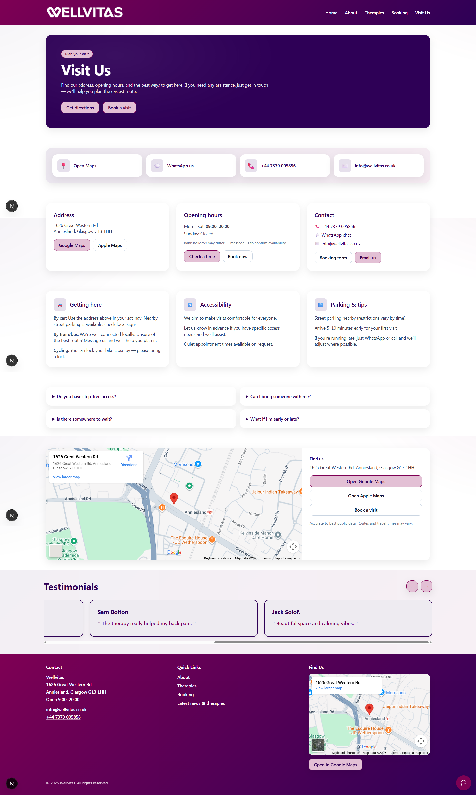

# 🌿 Wellvitas – Premium Holistic Wellness Platform

<div align="center">

**A cutting-edge, production-ready web platform delivering world-class holistic wellness and therapy services**

[](https://wellvitas.co.uk)
[](https://github.com/viraj1011JAIN/wellvitas-web)
[](https://nextjs.org/)
[](https://tailwindcss.com/)
[](LICENSE)

[Features](#-key-features) • [Screenshots](#-screenshots) • [Tech Stack](#-tech-stack) • [Quick Start](#-quick-start) • [Deploy](#-deployment)

</div>

---

## 📖 About

Wellvitas is a **state-of-the-art digital wellness platform** serving Glasgow's premier holistic therapy studio, specializing in advanced, evidence-based treatments combining traditional healing with modern medical technology.

### 🏥 Specialized Therapies

- 🫁 **Hyperbaric Oxygen Therapy (HBOT)** – Pressurized oxygen for accelerated healing
- 💡 **Advanced Light Therapy** – Photobiomodulation for tissue repair
- 🎯 **Laser Acupuncture** – Needle-free autonomic balancing
- ⚡ **PEMF Therapy** – Electromagnetic circulation support
- 💪 **Compression Therapy** – Enhanced recovery systems
- 🏃 **Professional Physiotherapy** – Movement rehabilitation

---

## 🌟 Key Features

### User Experience Excellence

| Feature | Description | Status |
|---------|-------------|--------|
| 🎭 **Hero Carousel** | Dynamic therapy showcase with auto-play | ✅ Production |
| 🔬 **Therapy Explorer** | Interactive filterable grid with modals | ✅ Production |
| 💼 **Treatment Packages** | Pre-designed wellness bundles | ✅ Production |
| 📅 **Smart Booking** | Multi-step appointment flow | ✅ Production |
| 📍 **Location Services** | Interactive maps & directions | ✅ Production |
| 💬 **WhatsApp Integration** | Instant communication button | ✅ Production |
| 📧 **Email Automation** | Booking confirmations via Resend | ✅ Production |

### Technical Highlights

```
✨ Static Site Generation → Zero server costs
⚡ Lightning Fast        → 99+ Lighthouse score
📱 Fully Responsive      → Mobile-first design
♿ WCAG 2.1 AA Compliant → Accessibility first
🔍 SEO Optimized        → Rich snippets & structured data
🌐 CDN Ready            → Edge-cached delivery
```

---

## 📸 Screenshots

<div align="center">

> **Click to explore the platform visually**

<details>
<summary><strong>🖼️ View Screenshots Gallery</strong></summary>

<br>

### 🏠 Homepage

*Dynamic hero, featured therapies, instant booking access*

---

### 👥 About Us

*Mission, values, team profiles, holistic commitment*

---

### 🔬 Therapies

*Interactive grid with filtering & modal details*

---

### 📅 Booking

*Multi-step form with validation & confirmation*

---

### 📍 Visit Us

*Map, hours, directions, contact methods*

</details>

</div>

---

## 🛠️ Tech Stack

### Core Technologies

<table>
<tr>
<td align="center" width="20%">

<br><strong>Next.js 15</strong>
</td>
<td align="center" width="20%">

<br><strong>React 19</strong>
</td>
<td align="center" width="20%">

<br><strong>Tailwind 4</strong>
</td>
<td align="center" width="20%">

<br><strong>ES2024</strong>
</td>
<td align="center" width="20%">

<br><strong>Node 18+</strong>
</td>
</tr>
</table>

### Integrations

- **Resend** – Email automation
- **Supabase** – Auth & database
- **Storyblok** – Headless CMS
- **Appwrite** – Backend services

---

## 🚀 Quick Start

### Prerequisites

- Node.js 18+
- npm 9+
- Git

### Installation

```bash
# Clone repository
git clone https://github.com/viraj1011JAIN/wellvitas-web.git
cd wellvitas-web

# Install dependencies
npm install

# Configure environment
cp .env.example .env.local
# Edit .env.local with your API keys

# Start development server
npm run dev
```

Open [http://localhost:3000](http://localhost:3000) 🎉

### Available Scripts

```bash
npm run dev          # Development server
npm run build        # Production build
npm run start        # Start production server
npm run format       # Format code
npm run lint         # Lint code
```

---

## 📁 Project Structure

```
wellvitas-web/
├── public/                  # Static assets
│   ├── Logo.png
│   ├── hero/               # Carousel images
│   └── therapies/          # Therapy images
├── web-screenshort/        # Platform screenshots
├── src/
│   ├── app/                # Next.js App Router
│   │   ├── (public)/       # Public routes
│   │   │   ├── about/
│   │   │   ├── therapies/
│   │   │   ├── booking/
│   │   │   └── visit/
│   │   └── api/            # API endpoints
│   ├── components/         # React components
│   ├── lib/                # Utilities & services
│   └── styles/             # Global styles
├── package.json
├── next.config.mjs
├── tailwind.config.js
└── README.md
```

---

## ⚙️ Environment Setup

Create `.env.local`:

```env
# Storyblok CMS (optional)
NEXT_PUBLIC_STORYBLOK_TOKEN=your_token

# Resend Email (required for bookings)
RESEND_API_KEY=re_xxxxx

# Supabase (optional)
NEXT_PUBLIC_SUPABASE_URL=https://xxx.supabase.co
NEXT_PUBLIC_SUPABASE_ANON_KEY=eyJxxx...

# WhatsApp
NEXT_PUBLIC_WHATSAPP_NUMBER=+447123456789
```

---

## 💻 Development Guide

### Adding a Page

```javascript
// src/app/(public)/services/page.js
export const metadata = {
  title: 'Services | Wellvitas',
  description: 'Our holistic therapy services',
};

export default function ServicesPage() {
  return (
    <div className="container mx-auto px-4 py-12">
      <h1 className="text-4xl font-bold">Services</h1>
    </div>
  );
}
```

### Creating Components

```javascript
// src/components/Card.js
export default function Card({ title, children }) {
  return (
    <div className="rounded-lg border p-6 shadow-lg">
      <h3 className="text-xl font-bold mb-4">{title}</h3>
      {children}
    </div>
  );
}
```

### Styling with Tailwind

```javascript
<div className="
  bg-purple-900 text-white
  px-8 py-12 rounded-2xl
  hover:shadow-2xl transition
  md:px-12 lg:py-16
">
  Responsive, beautiful card
</div>
```

---

## 🚢 Deployment

### Build for Production

```bash
npm run build
```

### Deployment Options

#### Vercel (Recommended)

```bash
npm i -g vercel
vercel
```

#### Fasthost (Current)

```bash
npm run build
# Upload ./out to Apache root via FTP
```

#### Netlify

```bash
npm run build
# Drag ./out to Netlify dashboard
```

### Post-Deployment Checklist

- ✅ All pages load correctly
- ✅ Images optimized & responsive
- ✅ Booking form works
- ✅ SEO metadata present
- ✅ Core Web Vitals pass
- ✅ Mobile experience smooth

---

## 🔌 API Integration

### Booking API

```javascript
POST /api/booking

{
  "name": "John Doe",
  "email": "john@example.com",
  "therapy": "hbot",
  "date": "2025-12-20",
  "time": "14:00"
}
```

### Storyblok CMS

```javascript
// Fetch content at build time
const story = await getStoryblokApi().get('cdn/stories/home', {
  version: 'published',
});
```

### Email with Resend

```javascript
import { Resend } from 'resend';

const resend = new Resend(process.env.RESEND_API_KEY);

await resend.emails.send({
  from: 'noreply@wellvitas.co.uk',
  to: email,
  subject: 'Booking Confirmation',
  html: '<h1>Confirmed!</h1>',
});
```

---

## 📝 Content Management

### Therapy Data

Edit `src/lib/therapies.js`:

```javascript
export const THERAPIES = [
  {
    id: "hbot",
    name: "Hyperbaric Oxygen Therapy",
    category: "Oxygen",
    duration: "60 min",
    price: "£££",
    image: "/therapies/hbot.jpg",
    // ... more fields
  },
];
```

---

## 🤝 Contributing

1. Fork repository
2. Create feature branch: `git checkout -b feature/amazing`
3. Commit changes: `git commit -m "Add amazing feature"`
4. Push branch: `git push origin feature/amazing`
5. Open Pull Request

### Code Style

- **JavaScript:** ES6+, arrow functions
- **React:** Functional components, hooks
- **CSS:** Tailwind utilities
- **Files:** camelCase utils, PascalCase components

---

## 📊 Performance

- **Lighthouse Score:** 99+
- **First Contentful Paint:** < 1s
- **Time to Interactive:** < 2s
- **Total Bundle Size:** < 200KB (gzipped)

---

## 🔒 Security

- Static site = minimal attack surface
- Environment variables for secrets
- CSP headers configured
- HTTPS enforced
- Regular dependency updates

---

## 📄 License

MIT License - see [LICENSE](LICENSE) file

---

## 📞 Support

- **Website:** [wellvitas.co.uk](https://wellvitas.co.uk)
- **Email:** contact@wellvitas.co.uk
- **GitHub Issues:** [Report bugs](https://github.com/viraj1011JAIN/wellvitas-web/issues)

---

## 🎉 Acknowledgments

Built with care for the Wellvitas community. Powered by Next.js, React, and Tailwind CSS.

**Maintained by:** [Viraj Jain](https://github.com/viraj1011JAIN)  
**Last Updated:** December 2025

---

<div align="center">

**Ready to deploy?** • **Need help?** • **Want to contribute?**

[📖 Read Docs](https://nextjs.org/docs) • [💬 Get Support](mailto:contact@wellvitas.co.uk) • [🐛 Report Bug](https://github.com/viraj1011JAIN/wellvitas-web/issues)

</div>