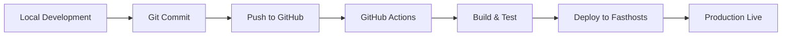

# Wellvitas Website - Technical Documentation

## Documentation Index

Welcome to the complete technical documentation for the Wellvitas holistic health website.

---

## 📁 Documentation Structure

### Architecture Documentation
- **[ARCHITECTURE_OVERVIEW.md](./ARCHITECTURE_OVERVIEW.md)** - System design and data flow
- **[CLIENT_SIDE.md](./CLIENT_SIDE.md)** - Client-side rendering and components
- **[SERVER_SIDE.md](./SERVER_SIDE.md)** - Server-side rendering and API
- **[ADMIN_SIDE.md](./ADMIN_SIDE.md)** - CMS integration and content management

### Component Documentation
- **[COMPONENTS_REFERENCE.md](./COMPONENTS_REFERENCE.md)** - All components API reference
- **[STORYBLOK_BLOCKS.md](./STORYBLOK_BLOCKS.md)** - Storyblok block components
- **[REUSABLE_COMPONENTS.md](./REUSABLE_COMPONENTS.md)** - Shared UI components

### Integration Documentation
- **[SUPERSAAS_INTEGRATION.md](./SUPERSAAS_INTEGRATION.md)** - Booking system integration
- **[STORYBLOK_INTEGRATION.md](./STORYBLOK_INTEGRATION.md)** - CMS integration details
- **[SUPABASE_INTEGRATION.md](./SUPABASE_INTEGRATION.md)** - Authentication system

### Development Documentation
- **[DEVELOPMENT_GUIDE.md](./DEVELOPMENT_GUIDE.md)** - Setup and development workflow
- **[DEPLOYMENT_GUIDE.md](./DEPLOYMENT_GUIDE.md)** - CI/CD and production deployment
- **[TESTING_GUIDE.md](./TESTING_GUIDE.md)** - Testing strategies and guidelines

---

## 🎯 Quick Navigation

### For Developers
Start here → [DEVELOPMENT_GUIDE.md](./DEVELOPMENT_GUIDE.md)  
Then read → [ARCHITECTURE_OVERVIEW.md](./ARCHITECTURE_OVERVIEW.md)  
Build features → [COMPONENTS_REFERENCE.md](./COMPONENTS_REFERENCE.md)

### For CMS Administrators
Start here → [ADMIN_SIDE.md](./ADMIN_SIDE.md)  
Content management → [../CMS_ADMIN_GUIDE.md](../CMS_ADMIN_GUIDE.md)  
Block reference → [STORYBLOK_BLOCKS.md](./STORYBLOK_BLOCKS.md)

### For DevOps
Deployment → [DEPLOYMENT_GUIDE.md](./DEPLOYMENT_GUIDE.md)  
Architecture → [ARCHITECTURE_OVERVIEW.md](./ARCHITECTURE_OVERVIEW.md)  
Server setup → [SERVER_SIDE.md](./SERVER_SIDE.md)

---

## 📊 Technology Stack

### Frontend
- **Framework:** Next.js 15.5.6 (App Router)
- **React:** 19.1.0 (with Server Components)
- **Styling:** Tailwind CSS 4.1.16
- **CMS:** Storyblok 5.4.18 (with RSC)

### Backend
- **Runtime:** Node.js (Next.js server)
- **Authentication:** Supabase Auth
- **Database:** Supabase PostgreSQL
- **Booking:** SuperSaaS (external API)

### Infrastructure
- **Hosting:** Fasthosts (static/SSR)
- **CI/CD:** GitHub Actions
- **SSL:** mkcert (local), Let's Encrypt (production)
- **Proxy:** local-ssl-proxy (development)

---

## 🏗️ System Architecture

```
┌─────────────────────────────────────────────────────────────┐
│                    CLIENT BROWSER                            │
├─────────────────────────────────────────────────────────────┤
│  React Components (Hydrated)                                 │
│  • Navigation, Footer (Client Components)                    │
│  • Interactive forms, booking widgets                        │
│  • Storyblok Visual Editor Bridge                            │
└──────────────────────┬──────────────────────────────────────┘
                       │ HTTP/HTTPS
                       ↓
┌─────────────────────────────────────────────────────────────┐
│              NEXT.JS 15 SERVER (SSR/RSC)                     │
├─────────────────────────────────────────────────────────────┤
│  Server Components (Pre-rendered)                            │
│  • Page layouts, content fetching                            │
│  • Storyblok API calls                                       │
│  • Middleware (auth, preview mode)                           │
└──────────────────────┬──────────────────────────────────────┘
                       │ API Calls
                       ↓
┌─────────────────────────────────────────────────────────────┐
│                 EXTERNAL SERVICES                            │
├─────────────────────────────────────────────────────────────┤
│  Storyblok CMS       SuperSaaS          Supabase             │
│  • Content storage   • Booking system   • Authentication     │
│  • Visual Editor     • Schedules        • User data          │
│  • Asset CDN         • Appointments     • Database           │
└─────────────────────────────────────────────────────────────┘
```

---

## 🔑 Key Concepts

### React Server Components (RSC)
Components that render on the server, reducing JavaScript bundle size and improving performance.

**Server Components:**
- Page layouts (`page.js`)
- Data fetching components
- Static content rendering

**Client Components:**
- Interactive UI (forms, buttons)
- Browser API usage (localStorage, etc.)
- Event handlers (onClick, onChange)

### Storyblok Integration
Headless CMS providing content management through blocks and stories.

**Key Features:**
- Visual Editor (live preview)
- Component mapping (React ↔ Storyblok)
- Draft/published versions
- Webhook-triggered deployments

### SuperSaaS Booking
Third-party scheduling system embedded via iframe.

**Integration Points:**
- Account credentials (environment variables)
- Schedule configuration (CMS-editable)
- Widget customization (styling, height)

---

## 📋 File Structure

```
starter-for-nextjs/
├── src/
│   ├── app/                      # Next.js App Router
│   │   ├── layout.js             # Root layout (Server Component)
│   │   ├── page.js               # Homepage (Server Component)
│   │   ├── [...slug]/            # Dynamic routes
│   │   ├── auth/                 # Authentication routes
│   │   ├── api/                  # API routes
│   │   └── middleware.js         # Edge middleware
│   ├── components/
│   │   ├── storyblock/           # Storyblok block components
│   │   │   ├── SuperSaaSBookingBlok.jsx
│   │   │   ├── NavigationBlok.jsx
│   │   │   ├── FooterBlok.jsx
│   │   │   ├── ButtonBlok.jsx
│   │   │   ├── ImageBlok.jsx
│   │   │   ├── RichTextBlok.jsx
│   │   │   ├── SEOBlok.jsx
│   │   │   └── ... (10 more blocks)
│   │   ├── auth/                 # Auth components
│   │   ├── StoryblokProvider.jsx # Client-side CMS bridge
│   │   └── ... (other shared components)
│   ├── lib/
│   │   ├── storyblok.js          # Storyblok SDK initialization
│   │   ├── therapies.js          # Therapy data utilities
│   │   └── auth/                 # Auth utilities
│   ├── providers/
│   │   └── AuthProvider.jsx      # Auth context provider
│   └── styles/
│       └── globals.css           # Global styles
├── public/                       # Static assets
├── docs/                         # 📁 Documentation (THIS FOLDER)
├── .github/workflows/            # CI/CD pipelines
├── next.config.mjs               # Next.js configuration
├── tailwind.config.js            # Tailwind CSS config
├── package.json                  # Dependencies
└── .env                          # Environment variables
```

---

## 🚀 Getting Started

### 1. Prerequisites
```bash
Node.js 20.x or higher
npm 10.x or higher
Git
Storyblok account
SuperSaaS account (optional)
```

### 2. Installation
```bash
git clone <repository-url>
cd starter-for-nextjs
npm install
```

### 3. Environment Setup
```bash
cp .env.example .env
# Edit .env with your credentials
```

### 4. Development
```bash
npm run dev          # Start dev server (port 3000)
npm run proxy        # Start HTTPS proxy (port 3010)
```

### 5. Build & Deploy
```bash
npm run build        # Production build
npm run start        # Start production server
```

---

## 📖 Reading Order

### For New Developers
1. [DEVELOPMENT_GUIDE.md](./DEVELOPMENT_GUIDE.md) - Setup your environment
2. [ARCHITECTURE_OVERVIEW.md](./ARCHITECTURE_OVERVIEW.md) - Understand the system
3. [CLIENT_SIDE.md](./CLIENT_SIDE.md) - Learn client architecture
4. [SERVER_SIDE.md](./SERVER_SIDE.md) - Learn server architecture
5. [COMPONENTS_REFERENCE.md](./COMPONENTS_REFERENCE.md) - Component APIs

### For CMS Admins
1. [ADMIN_SIDE.md](./ADMIN_SIDE.md) - CMS overview
2. [../CMS_ADMIN_GUIDE.md](../CMS_ADMIN_GUIDE.md) - Step-by-step guide
3. [STORYBLOK_BLOCKS.md](./STORYBLOK_BLOCKS.md) - Available blocks

### For DevOps Engineers
1. [ARCHITECTURE_OVERVIEW.md](./ARCHITECTURE_OVERVIEW.md) - System design
2. [SERVER_SIDE.md](./SERVER_SIDE.md) - Server configuration
3. [DEPLOYMENT_GUIDE.md](./DEPLOYMENT_GUIDE.md) - CI/CD setup

---

## 🔧 Environment Variables

```env
# Storyblok CMS
NEXT_PUBLIC_STORYBLOK_ACCESS_TOKEN=pXYm0ntr5Tgzae6F8nb22gtt
NEXT_PUBLIC_STORYBLOK_BRAND_SPACE_ID=288214049142470
NEXT_PUBLIC_STORYBLOK_DEFAULT_SPACE_ID=288214049142470
NEXT_PUBLIC_STORYBLOK_REGION=eu

# Supabase Authentication
NEXT_PUBLIC_SUPABASE_URL=<your-supabase-url>
NEXT_PUBLIC_SUPABASE_ANON_KEY=<your-anon-key>

# SuperSaaS Booking (optional - can be set in CMS)
NEXT_PUBLIC_SUPERSAAS_ACCOUNT=wellvitas
NEXT_PUBLIC_SUPERSAAS_SCHEDULE_ID=<schedule-id>
```

---

## 🎯 Key Features

### Content Management
- ✅ 17 fully editable Storyblok blocks
- ✅ Visual Editor with live preview
- ✅ Draft/published workflow
- ✅ Component-based architecture

### Booking System
- ✅ SuperSaaS integration
- ✅ Multiple schedule support
- ✅ CMS-configurable settings
- ✅ Mobile-responsive widget

### Authentication
- ✅ Supabase Auth integration
- ✅ Email/password login
- ✅ Social auth ready
- ✅ Protected routes

### Performance
- ✅ React Server Components
- ✅ Static generation where possible
- ✅ Image optimization
- ✅ Code splitting

### SEO
- ✅ Meta tags per page
- ✅ Open Graph support
- ✅ Twitter Cards
- ✅ Sitemap generation

---

## 🛠️ Development Workflow



---

## 📞 Support & Resources

### Internal Documentation
- Architecture: [ARCHITECTURE_OVERVIEW.md](./ARCHITECTURE_OVERVIEW.md)
- Components: [COMPONENTS_REFERENCE.md](./COMPONENTS_REFERENCE.md)
- Deployment: [DEPLOYMENT_GUIDE.md](./DEPLOYMENT_GUIDE.md)

### External Resources
- **Next.js:** https://nextjs.org/docs
- **Storyblok:** https://www.storyblok.com/docs
- **SuperSaaS:** https://www.supersaas.com/info/doc
- **Supabase:** https://supabase.com/docs
- **Tailwind CSS:** https://tailwindcss.com/docs

### Community
- GitHub Issues: <repository-url>/issues
- Team Wiki: <wiki-url>
- Slack Channel: #wellvitas-dev

---

## 🔄 Version History

| Version | Date | Changes |
|---------|------|---------|
| 2.0 | Dec 2025 | SuperSaaS + full CMS integration |
| 1.5 | Dec 2025 | RSC refactoring |
| 1.0 | Initial | Basic Next.js setup |

---

## 📝 Contributing

### Code Standards
- Use TypeScript or JSDoc for type safety
- Follow React best practices
- Write meaningful commit messages
- Add tests for new features

### Pull Request Process
1. Create feature branch from `main`
2. Make changes and test locally
3. Update documentation if needed
4. Submit PR with description
5. Wait for code review
6. Merge after approval

---

**Last Updated:** December 20, 2025  
**Maintained By:** Wellvitas Development Team  
**License:** Proprietary
